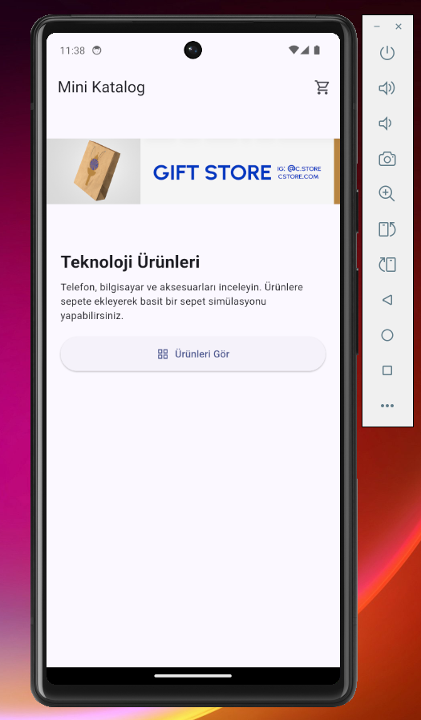
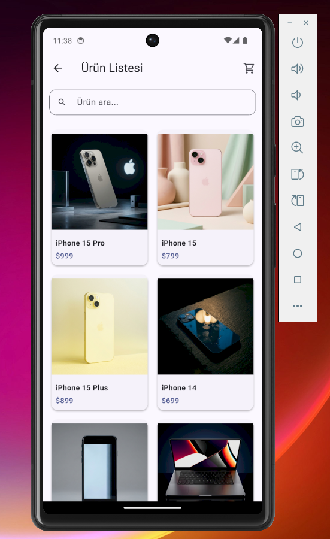
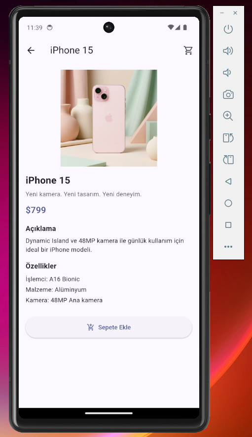
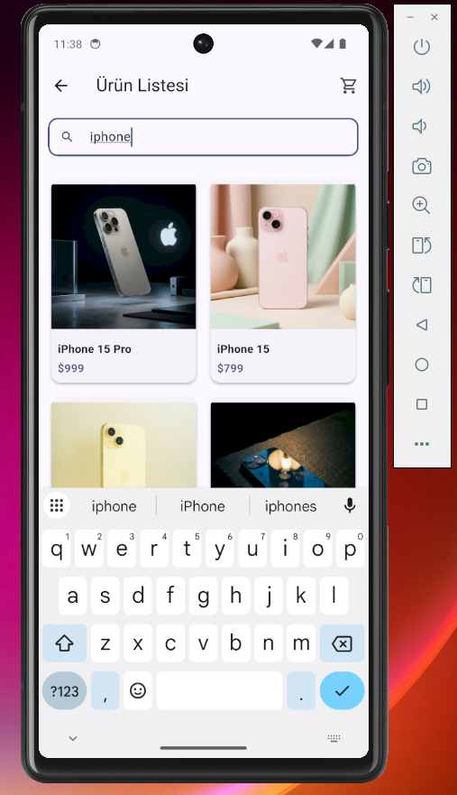
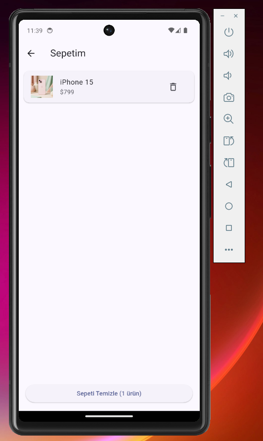

# Mini Katalog

Flutter ile gelistirilen basit bir urun katalog uygulamasi. Ana sayfa, urun listesi (GridView) ve urun detay ekranlari bulunur. Urunler wantapi.com API uzerinden cekilir; internet yoksa yerel JSON dosyasi kullanilir.

## Ozellikler

- Ana sayfa ve banner gorseli
- GridView ile urun listesi
- Urun detay ekrani (route arguments)
- Named routes ve MaterialPageRoute
- Arama / filtreleme
- Sepet simulasyonu (sepete ekle, sepet ekrani)
- JSON model (fromJson / toJson)
- Ek paket kullanilmadi (sadece material.dart)

## Gereksinimler

- Flutter SDK 3.44.2
- Android Studio veya VS Code
- Android emulator veya fiziksel cihaz

## Kurulum

1. Flutter SDK kurulu degilse: https://docs.flutter.dev/get-started/install/windows
2. Proje klasorune gidin:

```bash
cd C:\projects\mini_katalog
```

3. Bagimliliklari indirin:

```bash
flutter pub get
```

4. Uygulamayi calistirin:

```bash
flutter run
```

## Ekran Goruntuleri

### Ana Sayfa


### Urun Listesi


### Urun Detay


### Arama


### Sepet


## Proje Yapisi

```
lib/
  main.dart
  models/product.dart
  data/
    product_service.dart
    product_translations.dart
  screens/
    home_screen.dart
    product_list_screen.dart
    product_detail_screen.dart
    cart_screen.dart
  widgets/
    product_card.dart
    cart_icon_button.dart
assets/
  products.json
screenshots/
```

## Veri Kaynaklari

- API: https://wantapi.com/products.php
- Banner: https://wantapi.com/assets/banner.png
- Yerel yedek: assets/products.json

## Gelistirici

Elif Yurttakalan
